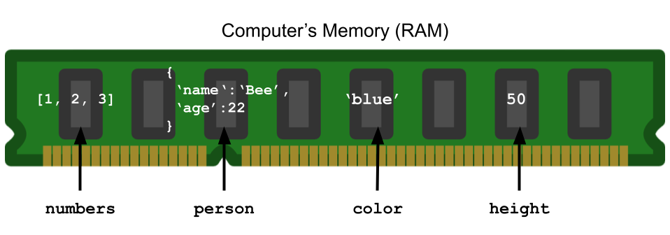
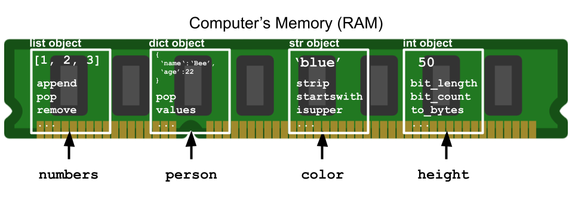
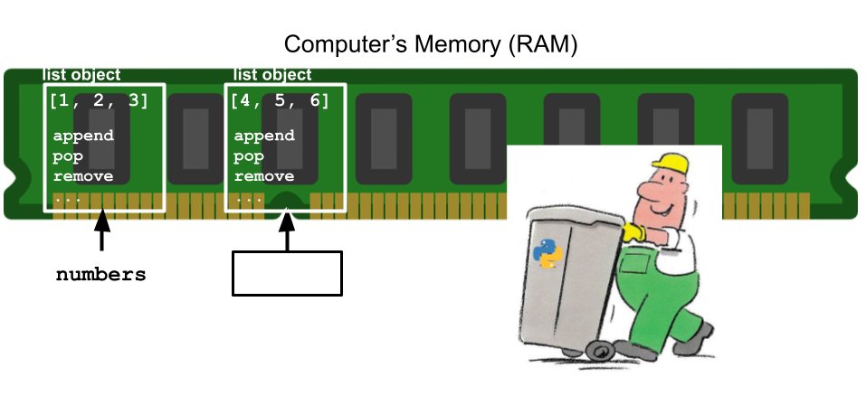
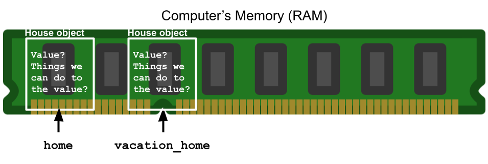

# Cookie Cutter House

(Introduction to object-oriented programming)

We have looked at many values so far...

```python
numbers = [1, 2, 3]
person = {
    'name': 'Bee',
    'age': 22
}
color = 'blue'
height = 50
pi = 3.14
is_valid = True
```

How does Python know what to show when we write

```python
color = 'blue'
print(color)
```

?

The value `'blue'` is stored somewhere in the computer's memory... 



**How do *you* know that you can call the following methods on `color`?**

```python
color = 'blue'
print(color.strip())
print(color.startswith('b'))
print(color.isupper())
```

Because the value of `color` (`'blue'`) is of type `str`, or string!

There is a set of methods that we can call on any value of type `str`.

Go to: https://docs.python.org/3/library/stdtypes.html#string-methods

**What is another method we can call on any value of type `str`?**

Python *also* needs to keep track of what we can do to each value in our programs, such as `'blue'`.

When we write `color = 'blue'`, Python knows that `'blue'` is a string because of the quotes. Python then stores

1. The value: `'blue'`
2. All of the things we can *do* to any string: `strip`, `startswith`, `isupper`, etc...

in the computer's memory. What is stored is determined by the type of the value (string).

This "thing" in memory that represents the value `'blue'` is called an **object**.



We can think of variables, like `color`, as addresses to objects in the computer's memory--they allow us to continue using these objects throughout our programs.

```python
numbers = [1, 2, 3] # numbers is an address to [1, 2, 3] list object
# Can use numbers to interact with [1, 2, 3] list object
numbers.append(7)
numbers.pop()
numbers.remove(2)
```

What about objects that are *not* mapped to a variable?

```python
print([4, 5, 6])
```

**Can we call `list` methods, such as `append`, `pop`, and `remove`, on the value `[4, 5, 6]`? Explain why or why not.**



If we want to continue using the `[4, 5, 6]` `list` object, we have to map it to a variable.


```python
more_numbers = [4, 5, 6]
more_numbers.append(10)
more_numbers.pop()
more_numbers.remove(5)
print(more_numbers)
```

    [4, 6]


Using a search engine, find a resource that shows all of the methods we can call on a value of type `list`.

**Write down your search query, the link to the resource you found, and one method you can call on any `list` object.**

What is **object-oriented programming (OOP)**?

A way of programming where each value is represented by an object that contains the value *and* what we can do to that value in the computer's memory.

Python is an OOP *language* because of the way it represents values as objects.

In OOP, objects (value and things we can do to the value) often reflect the real world.

In the real world, we refer to collections of items as "lists":

- Grocery list
- Todo list
- Bucket list

`list` objects are named as such because they too are collections of items.

Because we add items and remove items from real world lists, the `list` type has methods that allow us to add items and remove items as well.

Python allows us to define our own types and create objects of that type to represent real world things in our programs.

To know what types we need to define, we need to think about what *values* we want to store.

- Historical car catalog? `Car` type.
- Doggy day care management system? `Dog` type.
- Animal Crossing clone? `House` type.

**Imagine you want to build a new social media platform. What are three types that you might want to define?**

To define a new type, we use the `class` keyword.

```python
class Car:
    """Represent a car."""

class Dog:
    """Represent a dog."""
```

These are examples of class definition headers.

The word "class" is interchangeable with "type".


```python
print(type('blue'))
```

**Define a House type.**

We have not yet created any objects of type `House`--we just defined the `House` type.

Let's create some `House` objects.

We can create objects of built-in types by using a syntax Python will recognize.

```python
numbers = [1, 2, 3] # Square brackets
person = {
    'name': 'Bee',
    'age': 22
} # Curly braces
color = 'blue' # Quotes
height = 50 # Number without decimal
pi = 3.14 # Number with decimal
is_valid = True # Either True or False
```

To create objects of types *we* define, we need to explicitly state what type the object should be.

```python
herbie = Car()
winston = Dog()
```

To create an object of any type, we write the type followed by parentheses.

**Create two `House` objects, one named `home` and the other `vacation_home`. Print out their types. Then, check if `home` and `vacation_home` are the same object.**

What is the output? Are `home` and `vacation_home` the same object?

Everytime we call `House()`, we create a new object.



We need to define what will go in the white boxes (i.e. what House objects will look like).

There are two things we need to define:

1. The value
2. Things we can do to the value

We define these things in the class definition.
